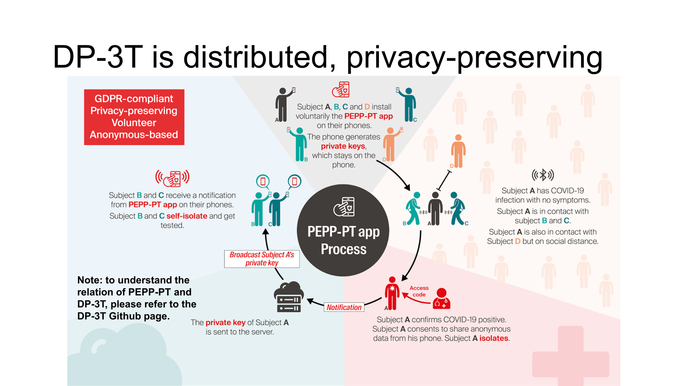

# DP3T Backend Specification

This proposal is based on the D3PT API specification found [here](https://github.com/DP-3T/dp3t-sdk-backend/blob/develop/documentation/documentation.pdf).

The aim of this proposal is twofold: firstly to improve the existing specification by including more details, such as extra HTTP headers. This helps to ensure compatibility between implementations. Secondly, we wish to extend the API to allow for a more efficient distribution of the Cuckoo Filter binary data. These filters will be downloaded by potentially hundreds of millions of users daily so there is a real benefit to doing so efficiently.

<Ryan: move this to a different proposal? it's orthogonal to data distribution although it will be required >

Thirdly and finally, we wish to add an mechanism to the API which supports the dynamic discovery of DP3T endpoints for different jurisdictions or countries. This enables the implementations to support infection checking across borders - something which is required in places such as mainland Europe. Especially around borders :)

## Big picture verview for app developers who haven't read anything else

<Ryan: I want the document to be self-contained, that makes it easier to onboard developers or at least parse the rest>

To check for infection: first load the list of data dumps from /exposed.

	for each (dump-you-havent-processed-or-which-has-a-new-hash)

		load data from `uri_filter` into your cocofilter
		run your local interactions through the cocofilter.

		if ( interaction in cocofilter )
			download the big list of ids from uri_data and check them
		else
			stop you're not exposed

## Existing Endpoints

Please refer to the D3PT API specifications for details on the parameters and message content. 

### POST /v1/exposed

<Ryan: I have nothing to add here>

### GET /v1/exposed/dayDateStr

#### Content-Type

	Content-Type: application/json; charset=UTF-8

#### Accept-Ranges
	
	Accept-Ranges: bytes

Allows requests for partial ranges, allowing for resume-support.

#### ETag

	ETag: "hash"

The hash identifies the binary data and it used for change-checking. By including a strong ETag we allow for the CDN/cache to work efficiently and support partial downloads.

The hash itself is the same sha-256 as described in the specifications.

## New Endpoints (for supporting multiple non-overlapping data dumps)

{batch-id} is a date/time in the form yyyymmddhhmm

### GET /v1/exposed [multiple batches, no overlap version]

Returns an json array containing a list of data batches in reverse-chronological order - so the latest update comes first. The timespan of the file is included along with a relative url to the coco filter binary and to the data file binary. The hash identifies the uri_data and thus changes if the data changes (so mistakes can be fixed).

These batches don't overlap, so they must all be downloaded.

<Ryan: I assume that the max length of this list is 14 days * 24 dumps * 200 bytes = 67200 bytes, 6720 bytes after gzip so small. >
<Ryan: You could also publish multiple batches: last 1-day, last 3-days, last-14 days and publish them on well known urls. >

#### Content-Type

	Content-Type: application/json; charset=UTF-8

#### ETag

	ETag: "hash"

<Ryan: can be any kind of hash, whats the most widely used default option? :) >

#### Message content

	{
		[{
			time_stamp_from: '2020-04-20T19:30:16Z',
			time_stamp_to: '2020-04-20T21:30:16Z',
			data_uri: '/exposed/data/2020041634'
		}, ...]
	}

### GET /v1/exposed/data/{batch-id}

Returns the Cuckoo Filter 

#### Content-Type

	Content-Type: application/octet-stream

#### Accept-Ranges
	
	Accept-Ranges: bytes

#### ETag

	ETag: "hash"

### GET /v1/exposed/filter/latest

Returns the last file to be uploaded, it's otherwise identical to GET /v1/exposed/data/{batch-id}

#### X-Previous
	
	X-Previous: /v1/exposed/{batch-id}

This header includes a link to the previously uploaded file. This allows the application to load all of the filters without calling the index (it forms a linked-list).

## New Endpoints (for supporting a 1-day, 3-d, n-day data file)

We provide the following endpoints which all have the same interface as `GET /v1/exposed/data/{batch-id}`.

	GET /v1/exposed/data/24h
	GET /v1/exposed/data/48h
	GET /v1/exposed/data/72h
	GET /v1/exposed/data/1w
	GET /v1/exposed/data/2w
	GET /v1/exposed/data/all

<Ryan: I would appreciate feedback on the data split and uris>

The advantage here is that the uris are fixed, the http clients / caches etc can use the ETag to handle updates and the clients only have to scan a single filter no matter how out-of-date their data is. This is expecially nice when clients need to scan for multiple countries (i.e. over multiple endpoints).

They can also regularly poll /v1/exposed/data/24h very cheaply because their http stack is only comparing the ETag hashes.

# OTHER STUFF

<Ryan: I'm using this section to dump ideas for now >

## /meta/configuration

Returns configuration for the risk algorithm:

see: end of page 11 of the WP https://github.com/DP-3T/documents/blob/master/DP3T%20White%20Paper.pdf

## /meta/authorities

Returns a list containing the infection authority per region/country. Where this api can be found so you can check your risks if you've been abroad.

	GET /meta/authorities

	application/json

	{
		"NL": "",
		"DE": "",
		...
	}

*Ryan: ideally this would be a published at a single well known source globally and not included in an api.*

# Messages

## CoCoFilterFormat

Define it.

## ExposedDeviceIdentifiersFormat

Define it.

